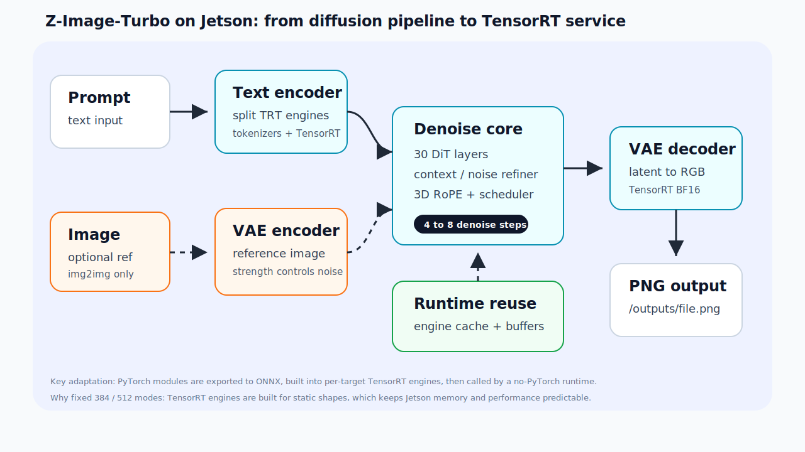
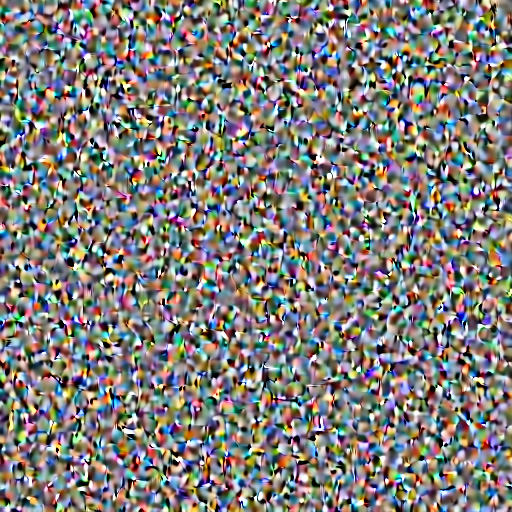

# 当机器人需要想象世界：把 Z-Image-Turbo 搬到 Jetson 的边缘计算实践

> 这篇文章讲的不是“我们生成了一张图片”这么简单。图片生成只是一个入口：真正的问题是，当一个机器人离开室内、进入户外、远离稳定网络以后，它还能不能在本地理解环境、生成视角、辅助决策？

## 从一个户外机器人场景说起

想象一辆小车正在开往户外。车上坐着一个小机器人。它看见的世界和人不一样：它关心的不是这张照片好不好看，而是哪里可以走、哪里有风险、远处的光照会不会影响视觉、参考图和文字指令能不能合成出它需要的“任务视角”。

文章正式发布时，这里会放两张真实图片：

- 第一张：户外现场原图，也就是设备真实看到的画面。
- 第二张：把这张现场图作为参考图，再用 image-to-image 和 prompt 生成出的“机器人/计算机视角”风格图。

这组图只是导入。它像一个影子，帮助读者快速理解：我们不是为了单纯生成漂亮图片，而是希望让边缘设备在现场拥有更强的视觉表达和环境理解能力。

这就是我们为什么关注边缘端图像生成。它不只是为了“画图”，而是为了让设备在现场拥有更强的视觉处理能力。

## 为什么一定要做边缘计算

如果只是做一个网页 demo，把图片传到云端 GPU，几秒钟返回结果，当然最简单。但户外机器人、巡检车、农业设备、移动机器人遇到的问题不一样。

第一，网络不稳定。户外场景经常没有稳定 Wi-Fi，蜂窝网络也可能延迟高、带宽低，甚至完全不可用。如果视觉能力依赖云端，一旦断网，机器人就等于失去一部分感知能力。

第二，延迟很敏感。很多场景不是“等一会儿也行”。机器人在移动，环境在变化，图像处理结果越靠近设备本地，反馈链路越短。

第三，隐私和数据成本更可控。摄像头拍到的原始图像可能包含人员、车牌、厂区环境或农场现场。把数据留在设备上，既减少上传成本，也降低数据外流风险。

第四，设备需要独立工作。一个真正可部署的边缘系统，不能假设旁边永远有云端、工作站和工程师。它应该可以开机、加载模型、接收请求、生成结果、保存文件。

所以这次我们要解决的问题是：能不能把一个通用的 6B 级图像生成模型，整理成一个可以在 Jetson 上运行的边缘端服务？

## 选 Z-Image-Turbo 只是起点

Z-Image-Turbo 是一个 6B 规模的 DiT 图像生成模型。可以把它简单理解成一个“在 latent 空间里一步步把噪声变成图像”的模型。

text-to-image 的流程大概是：

1. prompt 进入 tokenizer 和 text encoder，变成文本特征。
2. 系统从随机 latent 噪声开始。
3. transformer denoise 主体按 step 一轮轮去噪。
4. VAE decoder 把 latent 解码成 RGB 图片。

image-to-image 会多一条参考图路径：

1. 参考图先进入 VAE encoder，变成 latent。
2. 根据 `strength` 加噪。
3. 再结合 prompt 进入同一个 denoise 主体。



在云端或桌面 GPU 上，直接用 PyTorch / diffusers 跑这条链路很自然。但在 Jetson 上，问题马上出现：

- 运行镜像太大，PyTorch、diffusers、transformers 会把环境撑得很重。
- 模型大，显存和统一内存压力高，稍不注意就 OOM。
- Python 调度和模型加载开销明显。
- ONNX、TensorRT engine、权重都很大，不能直接塞进 GitHub。

因此，我们的目标不是“让脚本偶尔跑通”，而是把它变成一个 no-PyTorch 的 TensorRT runtime：可以部署、可以复现、可以通过 HTTP API 调用。

## 模型适配真正难在哪里

把通用模型搬到边缘设备上，最难的地方不是写一个 `docker run`。难点通常藏在模型结构、数值精度、内存管理和验证方法里。

### 1. 不能把 6B 模型当成一个整体硬塞进去

Z-Image-Turbo 的主体是 30 层 transformer。直接把整个模型导成一个巨大 engine，对 Jetson 不友好：

- engine 构建时间长。
- 单个文件很大。
- 加载峰值高。
- 中间某一层出错时很难定位。

所以我们把模型拆成很多块：

- transformer 30 层逐层导出。
- prompt preprocessor / latent preprocessor / final projection 单独导出。
- context refiner / noise refiner 单独导出。
- VAE encoder / decoder 单独导出。
- text encoder 后续改成分组 TensorRT engine。

这样做会让 runtime 调度变复杂，但换来了一个很重要的能力：每一层都可以单独验证、单独替换、单独缓存。

### 2. 能生成图片，不代表图片是对的

这是生成模型适配里最容易踩的坑。

程序不崩溃、engine 能构建、最后保存了 png，并不等于模型语义正确。下面这张图就是适配过程中真实生成过的失败结果。



它不是风格问题，而是 denoise 基本失效了。根因是 `noise_refiner` 的导出分支和真实 PyTorch 调用路径不一致。

Z-Image basic mode 实际使用的是全局 `adaln_input` 调制；旧 TensorRT export 走成了 `noise_mask / t_noisy / t_clean` 分支。engine 可以跑，但语义错了。这个问题不会靠端到端 smoke test 自动暴露，只能靠逐层对比定位。

中间也出现过另一种更迷惑的状态：图里已经能看到猫、窗户和光照，但整体发糊，脸部和纹理结构不稳定。


这种图比纯噪声更容易误判，因为它看起来“差不多像一张图”。但对模型适配来说，这仍然是不正确的结果：说明主链路已经接起来了，但某些模块、数值精度或中间 tensor 语义还没有完全对齐。我们后来把它归类为过程图，而不是最终效果图。

我们最后做的是：

- PyTorch 输出作为 reference。
- ONNX 输出和 PyTorch 对比。
- TensorRT 输出和 ONNX / PyTorch 对比。
- 每一层检查误差和 tensor 统计。

修复后重新导出 `noise_refiner_00/01`，输入对齐真实调用路径：

- `x`
- `attn_mask`
- `freqs_cis`
- `adaln_input`

修复之后，512 TensorRT 输出恢复正常。


### 3. 数值精度不是随便从 FP32 换成 FP16

边缘设备上做加速，经常会想到 FP16。但不是所有模块都能直接用 FP16 稳定跑。

早期 VAE TensorRT 版本就出现过黑图：


单看服务，它可能仍然返回“成功生成了 png”。但实际是 VAE decoder 在 Orin NX 上的 FP16 构建路径出现数值异常，最终 RGB 几乎全黑。

后续我们改用 BF16 VAE decoder，并在调试阶段加入 tensor 统计检查。经验很直接：生成模型的数值错误不一定表现为崩溃，也可能表现为一张“看起来合法但完全错误”的图片。

### 4. 内存比算力更早成为瓶颈

在 Jetson 上，很多优化表面看是性能问题，本质是内存问题。

例如，TensorRT engine 加载本身有成本。每一层用完就卸载，省内存但慢；全部缓存，速度快但容易 OOM。我们最后做了两件事：

- 允许配置 layer engine cache 数量，例如 `MAX_CACHED_LAYERS=18`。
- 在 no-PyTorch runtime 里复用 layer 输出 buffer，避免反复申请大块 CUDA 内存。

去掉 PyTorch 也很关键。如果 runtime 里还保留 PyTorch / diffusers / transformers，它们会常驻内存，挤占本来可以用于 TensorRT engine cache 的空间。no-PyTorch 之后，384 模式在 Orin NX 16GB 上可以缓存全部 30 个 denoise layer。

### 5. 分辨率也不是随便动态切

TensorRT engine 通常更适合静态 shape。为了稳定和性能，我们先做了两个固定档位：

- 384x384
- 512x512

部署时通过 `RESOLUTION=384` 或 `RESOLUTION=512` 选择。这样做的好处是简单、稳定、可控；代价是要支持更多尺寸，就需要额外导出和构建对应 engine。

### 6. image-to-image 不是多传一张图那么简单

img2img 多了一条 VAE encode 路径，也多了一个重要参数：`strength`。

通俗地说：

- strength 低：更保留原图，变化小。
- strength 高：更听 prompt，变化大。
- 在固定 `num_steps` 下，strength 还会影响实际 denoise step 数。

例如 8 steps、strength 0.65 时，实际 denoise steps 是 5。这会同时影响速度、显存压力和最终效果。

我们已有一个很直观的 image-to-image 例子。左边是参考图，右边是在参考图基础上加 prompt 生成的结果：猫的主体、姿态和窗边环境基本保留，但模型按照 prompt 给它加上了红色围巾。

| 参考图 | image-to-image 输出 |
|---|---|
|  |  |

## 最后做成了什么

最终我们得到的是一个 no-PyTorch 的 TensorRT runtime：

- 支持 384x384 和 512x512。
- 支持 text-to-image。
- 支持 image-to-image，也就是参考图加文字 prompt。
- 支持 HTTP API 调用。
- 支持把生成结果保存到用户指定的 host 目录。
- 支持通过 `/outputs/<file>.png` 下载生成图片。
- Runtime Docker 镜像约 428MB。
- 大的 TensorRT engines 独立发布到 Hugging Face artifact repo。

512 TensorRT 正常输出样例如下：


API 调用方式类似这样：

```bash
curl -X POST http://<jetson-ip>:8000/generate_json \
  -H "Content-Type: application/json" \
  -d '{
    "prompt": "A cute orange tabby cat sitting on a sunny windowsill, photorealistic",
    "num_steps": 4,
    "seed": 42,
    "output_name": "cat.png"
  }'
```

返回结果里会有本地文件路径和可下载 URL：

```json
{
  "success": true,
  "image_path": "/output/cat.png",
  "image_url": "/outputs/cat.png",
  "elapsed_seconds": 118.648,
  "trt_seconds": 78.3
}
```

输出目录不是写死的。启动服务时可以用 `OUTPUT_DIR_HOST` 指定 host 侧目录：

```bash
OUTPUT_DIR_HOST=/data/z-image-output \
UPLOAD_DIR_HOST=/data/z-image-input \
scripts/run/run_3drope_no_torch_api.sh
```

容器里统一挂载为 `/output` 和 `/uploads`，但 host 上放在哪里由用户自己决定。

## 性能和体积

在 Jetson Orin NX 16GB 上，当前验证结果如下。

| 模式 | 设置 | 总耗时 | TensorRT denoise |
|---|---|---:|---:|
| 384 text-to-image | 4 steps, cache 30 layers | 92.8s | 56.2s |
| 384 image-to-image | 8 steps, strength 0.65, cache 18 layers | 123.1s | 86.9s |
| 512 text-to-image | 4 steps, cache 18 layers | 117.4s | 80.1s |
| 512 image-to-image | 8 steps, strength 0.65, cache 18 layers | 129.7s | 91.6s |
| 512 API text-to-image | 4 steps | 118.648s | 78.3s |
| 512 API image-to-image | 4 steps, strength 0.65 | 86.276s | 46.4s |

Runtime 镜像约 428MB，不再需要 PyTorch、diffusers、transformers。大文件放在独立 artifact repo：

```text
harvestsu/z-image-turbo-jetson-trt-artifacts
```

engine 体积大约是：

- 384 engines：约 12.8GB
- 512 engines：约 13.0GB
- split text encoder engines：约 16.1GB

这些数字不是云端 GPU 的速度，但它们说明了一件事：一个 6B 级别的通用图像生成模型，可以被整理成一个能在 Jetson 上稳定运行的边缘端服务。

## 这件事的价值

图片生成只是表层。更重要的是，这次适配形成了一套把通用模型搬到边缘平台的方法：

1. 把大模型拆成可验证的小 engine。
2. 用逐层对比保证正确性，而不是只看最终图片。
3. 把 VAE、text encoder、denoise 主体逐步迁到 TensorRT。
4. 去掉 PyTorch runtime，降低镜像体积和内存占用。
5. 通过 engine cache 和 buffer 复用平衡速度与内存。
6. 用 HTTP API 把 demo 变成服务。
7. 用独立 artifact repo 发布大文件，让开源仓库保持轻量。

对户外机器人来说，这意味着它不必永远依赖云端。它可以在本地处理图像、生成任务视角、保存结果，并在网络不稳定时继续工作。

对工程师来说，这次经验也说明了另一个现实：通用 AI 模型要真正跑到边缘设备上，中间要经历模型拆分、导出、构建、逐层对比、数值修复、内存优化、接口封装和 artifact 发布。只有这些都做完，它才从“模型”变成“可以部署的系统”。

## 还可以继续优化什么

目前还有继续提升的空间：

- 用 C++ runtime 减少 Python 调度开销。
- 做更大的 layer group engine，减少 engine 调用次数。
- 针对 BF16 / FP16 cast 写更轻量的 CUDA kernel。
- 针对 8GB 设备单独做更激进的内存策略。
- 增加更多分辨率档位，但需要对应构建新的 TensorRT engines。

这不是一个结束点，而是一个起点：让更多通用视觉和生成模型能够离开云端，真正进入边缘现场。
